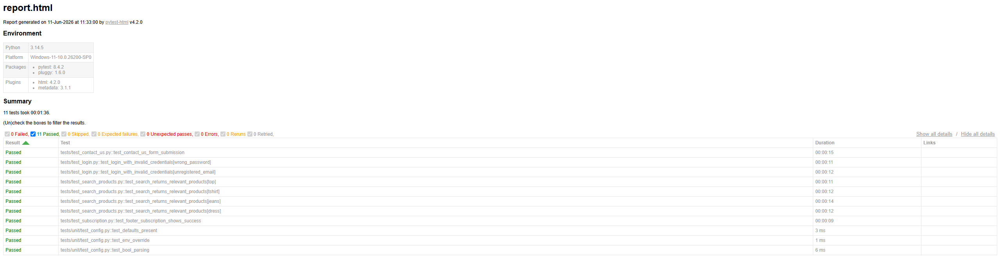

# Selenium + Pytest UI Automation Framework

[](https://github.com/Notch-oss/selenium-pytest-framework/actions/workflows/ci.yml)

A Page Object Model UI automation framework built with **Selenium 4** and
**pytest**, exercised against [automationexercise.com](https://automationexercise.com).
Explicit waits only, config-driven, data-driven, with logging,
screenshot-on-failure, HTML reporting, and GitHub Actions CI.

It also ships a **REST API test layer** (`requests`-based) covering all 14
endpoints from the site's [API list](https://automationexercise.com/api_list) —
see [API tests](#api-tests).

---

## What this demonstrates

| Requirement | Where |
|---|---|
| Page Object Model with a `BasePage` of common wrappers | `pages/base_page.py`, inherited by every page in `pages/` |
| Pytest fixtures for driver setup/teardown, scoped correctly | `conftest.py` (`driver`, function-scoped) |
| Config-driven (URL, browser, timeouts) — no hardcoding | `config/config.py`, env-driven via `.env` / CI vars |
| Explicit waits only — no `time.sleep()` anywhere | `WebDriverWait` + `expected_conditions` in `BasePage` |
| Data-driven via `parametrize` from external files | `data/*.json` loaded in `tests/test_login.py`, `tests/test_search_products.py` |
| Logging (no `print`) | `utils/logger.py` |
| Screenshot on failure | `pytest_runtest_makereport` hook in `conftest.py` |
| HTML reporting | `pytest-html` → `reports/report.html` |
| REST API testing layer (all 14 site APIs) | `api/`, `tests/test_api.py` |
| CI on every push, headless | `.github/workflows/ci.yml` |

---

## Project structure

```
.
├── config/
│   └── config.py            # env-driven settings (URL, browser, timeouts, paths)
├── api/                     # REST API client layer (mirrors the POM idea)
│   ├── base_client.py       # HTTP session, retries, timeout, ApiResponse wrapper
│   └── automation_exercise_api.py  # one method per documented endpoint (API 1-14)
├── pages/
│   ├── base_page.py         # shared wrappers: click, type, find, waits, alerts
│   ├── home_page.py         # header/footer (site-wide), categories, carousel
│   ├── login_page.py
│   ├── signup_page.py       # account form + created/deleted confirmations
│   ├── products_page.py
│   ├── product_detail_page.py
│   ├── cart_page.py         # cart table + the post-add-to-cart modal
│   ├── checkout_page.py
│   ├── payment_page.py
│   └── contact_page.py
├── tests/
│   ├── flows.py             # multi-page flows: register, checkout-and-pay
│   ├── test_register.py
│   ├── test_login.py        # valid login/logout + data-driven invalid cases
│   ├── test_search_products.py
│   ├── test_products.py     # product detail, categories, brands, reviews
│   ├── test_cart.py
│   ├── test_checkout.py     # end-to-end order placement
│   ├── test_navigation.py
│   ├── test_subscription.py
│   ├── test_contact_us.py
│   ├── test_api.py          # all 14 REST API cases (browserless)
│   └── unit/
│       └── test_config.py   # browserless — verifies config wiring in CI
├── data/
│   ├── login_data.json
│   ├── search_data.json
│   └── api_search_data.json # data-driven cases for the API search test
├── utils/
│   ├── driver_factory.py    # builds chrome/firefox, headless toggle
│   ├── user_factory.py      # unique registration data (UI + API payloads)
│   ├── logger.py
│   └── data_loader.py
├── conftest.py              # driver fixture + screenshot-on-failure hook
├── pytest.ini               # report, markers, logging, pythonpath
├── requirements.txt
├── .env.example
└── .github/workflows/ci.yml
```

### Design notes

- **`BasePage` owns synchronisation, page objects own intent.** A page class
  declares locators and exposes verbs like `login(email, password)` — it never
  touches `WebDriverWait` directly. `BasePage.click()` falls back to a JS click
  when a real click is intercepted, which is common on this ad-heavy target.
- **Function-scoped `driver`.** Every test gets a fresh browser so state never
  leaks between tests. A session-scoped driver is faster but couples tests
  together; isolation is the better default for a UI suite. Swap the scope in
  `conftest.py` if you want to trade isolation for speed.
- **No implicit wait is set.** Mixing implicit and explicit waits causes
  unpredictable timeouts, so all synchronisation is explicit.
- **The API layer mirrors the POM split.** `BaseApiClient` owns HTTP mechanics
  (pooled session, connection retries, timeout, logging) the way `BasePage` owns
  synchronisation; `AutomationExerciseApiClient` exposes intent (`search_product`,
  `verify_login`, …) the way page objects expose verbs. Tests never touch
  `requests` directly. The API returns transport `200` for *everything* and puts
  the real code in the body's `responseCode`, so `ApiResponse.response_code`
  centralises that quirk in one place — see
  [docs/api_test_cases.md](docs/api_test_cases.md).

---

## Setup

Requires Python 3.10+ and Chrome (or Firefox) installed locally. Selenium 4.6+
ships **Selenium Manager**, so you do **not** need to download a driver binary.

```bash
git clone https://github.com/Notch-oss/selenium-pytest-framework.git
cd <selenium-pytest-framework>

python -m venv .venv
source .venv/bin/activate        # Windows: .venv\Scripts\activate

pip install -r requirements.txt
cp .env.example .env             # optional — defaults work out of the box
```

---

## Running the tests

```bash
# Everything
pytest

# Headless
HEADLESS=true pytest

# Firefox instead of Chrome
BROWSER=firefox pytest

# Only smoke tests
pytest -m smoke

# A single file
pytest tests/test_login.py -v

# Only the REST API tests (browserless — no Chrome/Firefox needed)
pytest -m api
```

All settings are env-overridable (see `.env.example`): `BASE_URL`, `BROWSER`,
`HEADLESS`, `WINDOW_SIZE`, `EXPLICIT_TIMEOUT`, `PAGE_LOAD_TIMEOUT`.

### Outputs (all gitignored)

- `reports/report.html` — self-contained HTML report
- `screenshots/` — PNG captured automatically on any test failure
- `logs/automation.log` — full run log

---

## Report

`pytest-html` produces a self-contained report at `reports/report.html`. Open it
in a browser after a run. Failing tests automatically embed their screenshot.




---

## CI

`.github/workflows/ci.yml` runs on every push and PR to `main`/`master`:
installs dependencies, sets up Chrome, runs the browserless unit tests, then the
browserless API tests, then the UI suite headless, and uploads the HTML report
and any failure screenshots as build artifacts. The status badge at the top
reflects the latest run.

---

## Test coverage

The UI suite implements all 26 scenarios from the site's official
[test cases page](https://automationexercise.com/test_cases) — see
`docs/test_cases.md` for the full step-by-step reference. The REST API suite
implements all 14 endpoints from the official
[API list](https://automationexercise.com/api_list) — see the
[API tests](#api-tests) section and `docs/api_test_cases.md`.

| Test | Type | Scenario (site TC #) |
|---|---|---|
| `test_register_new_user` | smoke | full signup, login state, account deletion (1) |
| `test_register_with_existing_email_shows_error` | regression | duplicate-email signup rejected (5) |
| `test_login_with_valid_credentials` | smoke | valid login + delete account (2) |
| `test_login_with_invalid_credentials` | data-driven | invalid login → error message (3) |
| `test_logout_returns_to_login_page` | smoke | logout drops the session (4) |
| `test_contact_us_form_submission` | regression | contact form submit + JS alert handling (6) |
| `test_test_cases_page_is_reachable` | smoke | header navigation (7) |
| `test_all_products_and_product_detail` | smoke | products list + detail fields (8) |
| `test_search_returns_relevant_products` | data-driven | product search returns relevant results (9) |
| `test_footer_subscription_shows_success` | smoke | newsletter subscription on home (10) |
| `test_subscription_on_cart_page` | smoke | newsletter subscription on cart page (11) |
| `test_add_products_to_cart` | smoke | two products, prices x quantities = totals (12) |
| `test_product_quantity_in_cart` | regression | detail-page quantity preserved in cart (13) |
| `test_place_order_register_while_checkout` | regression | E2E order, signup mid-checkout (14) |
| `test_place_order_register_before_checkout` | regression | E2E order, signup first (15) |
| `test_place_order_login_before_checkout` | regression | E2E order, existing account (16) |
| `test_remove_product_from_cart` | regression | X button empties the cart (17) |
| `test_view_category_products` | regression | sidebar category navigation (18) |
| `test_view_brand_products` | regression | sidebar brand navigation (19) |
| `test_search_products_and_verify_cart_after_login` | regression | guest cart survives login (20) |
| `test_add_review_on_product` | regression | product review submission (21) |
| `test_add_to_cart_from_recommended_items` | regression | recommended-items carousel add (22) |
| `test_address_details_match_registration` | regression | checkout addresses echo signup data (23) |
| `test_download_invoice_after_purchase` | regression | invoice file actually downloads (24) |
| `test_scroll_up_with_arrow_button` | regression | scroll-up arrow returns to hero (25) |
| `test_scroll_up_without_arrow_button` | regression | manual scroll returns to hero (26) |
| `test_config.*` | unit | config env-override wiring (browserless) |

---

## API tests

`tests/test_api.py` covers **all 14 endpoints** from the site's official
[API list](https://automationexercise.com/api_list), driven through
`api/automation_exercise_api.py`. They are **browserless** (`requests` only), so
they run in seconds and stay green even when the UI target is flaky behind
Cloudflare. Run them with `pytest -m api`. Full step reference:
[docs/api_test_cases.md](docs/api_test_cases.md).

| Test | API # | Method + endpoint | Asserts |
|---|---|---|---|
| `test_api_01_get_all_products_list` | 1 | GET `/productsList` | 200, non-empty `products` |
| `test_api_02_post_to_all_products_list_not_supported` | 2 | POST `/productsList` | 405, "method not supported" |
| `test_api_03_get_all_brands_list` | 3 | GET `/brandsList` | 200, non-empty `brands` |
| `test_api_04_put_to_all_brands_list_not_supported` | 4 | PUT `/brandsList` | 405, "method not supported" |
| `test_api_05_search_product` | 5 | POST `/searchProduct` | 200, results match term (data-driven ×4) |
| `test_api_06_search_product_without_param` | 6 | POST `/searchProduct` | 400, "search_product missing" |
| `test_api_07_verify_login_valid` | 7 | POST `/verifyLogin` | 200, "User exists!" |
| `test_api_08_verify_login_without_email` | 8 | POST `/verifyLogin` | 400, "email or password missing" |
| `test_api_09_verify_login_delete_not_supported` | 9 | DELETE `/verifyLogin` | 405, "method not supported" |
| `test_api_10_verify_login_invalid` | 10 | POST `/verifyLogin` | 404, "User not found!" |
| `test_api_11_create_account` | 11 | POST `/createAccount` | 201, "User created!" + verify exists |
| `test_api_12_delete_account` | 12 | DELETE `/deleteAccount` | 200, "Account deleted!" + verify gone |
| `test_api_13_update_account` | 13 | PUT `/updateAccount` | 200, "User updated!" + change persists |
| `test_api_14_get_user_detail_by_email` | 14 | GET `/getUserDetailByEmail` | 200, `user` matches created data |

---

## Notes / honest caveats

- `automationexercise.com` is a live third-party site with ads and an
  occasional Google consent dialog. `BasePage.dismiss_consent_if_present()` is a
  best-effort handler; if locators drift because the site changed, update them
  in the relevant page object — that's the POM working as intended.
- The unit tests are verified passing. The UI tests are written against the
  site's current DOM and run headless in CI; if a selector breaks, it's a
  one-line fix in `pages/`, not a rewrite.
