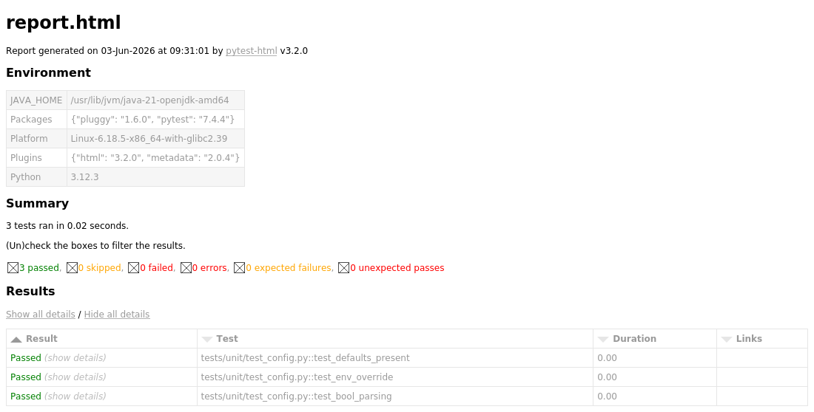

# Selenium + Pytest UI Automation Framework

[](https://github.com/Notch-oss/selenium-pytest-framework/actions/workflows/ci.yml)

A Page Object Model UI automation framework built with **Selenium 4** and
**pytest**, exercised against [automationexercise.com](https://automationexercise.com).
Explicit waits only, config-driven, data-driven, with logging,
screenshot-on-failure, HTML reporting, and GitHub Actions CI.

---

## What this demonstrates

| Requirement | Where |
|---|---|
| Page Object Model with a `BasePage` of common wrappers | `pages/base_page.py`, inherited by every page in `pages/` |
| Pytest fixtures for driver setup/teardown, scoped correctly | `conftest.py` (`driver`, function-scoped) |
| Config-driven (URL, browser, timeouts) — no hardcoding | `config/config.py`, env-driven via `.env` / CI vars |
| Explicit waits only — no `time.sleep()` anywhere | `WebDriverWait` + `expected_conditions` in `BasePage` |
| Data-driven via `parametrize` from external files | `data/*.json` loaded in `tests/test_login.py`, `tests/test_search_products.py` |
| Logging (no `print`) | `utils/logger.py` |
| Screenshot on failure | `pytest_runtest_makereport` hook in `conftest.py` |
| HTML reporting | `pytest-html` → `reports/report.html` |
| CI on every push, headless | `.github/workflows/ci.yml` |

---

## Project structure

```
.
├── config/
│   └── config.py            # env-driven settings (URL, browser, timeouts, paths)
├── pages/
│   ├── base_page.py         # shared wrappers: click, type, find, waits, alerts
│   ├── home_page.py
│   ├── login_page.py
│   ├── products_page.py
│   └── contact_page.py
├── tests/
│   ├── test_login.py        # data-driven invalid-login cases
│   ├── test_search_products.py
│   ├── test_subscription.py
│   ├── test_contact_us.py
│   └── unit/
│       └── test_config.py   # browserless — verifies config wiring in CI
├── data/
│   ├── login_data.json
│   └── search_data.json
├── utils/
│   ├── driver_factory.py    # builds chrome/firefox, headless toggle
│   ├── logger.py
│   └── data_loader.py
├── conftest.py              # driver fixture + screenshot-on-failure hook
├── pytest.ini               # report, markers, logging, pythonpath
├── requirements.txt
├── .env.example
└── .github/workflows/ci.yml
```

### Design notes

- **`BasePage` owns synchronisation, page objects own intent.** A page class
  declares locators and exposes verbs like `login(email, password)` — it never
  touches `WebDriverWait` directly. `BasePage.click()` falls back to a JS click
  when a real click is intercepted, which is common on this ad-heavy target.
- **Function-scoped `driver`.** Every test gets a fresh browser so state never
  leaks between tests. A session-scoped driver is faster but couples tests
  together; isolation is the better default for a UI suite. Swap the scope in
  `conftest.py` if you want to trade isolation for speed.
- **No implicit wait is set.** Mixing implicit and explicit waits causes
  unpredictable timeouts, so all synchronisation is explicit.

---

## Setup

Requires Python 3.10+ and Chrome (or Firefox) installed locally. Selenium 4.6+
ships **Selenium Manager**, so you do **not** need to download a driver binary.

```bash
git clone https://github.com/<your-username>/<your-repo>.git
cd <your-repo>

python -m venv .venv
source .venv/bin/activate        # Windows: .venv\Scripts\activate

pip install -r requirements.txt
cp .env.example .env             # optional — defaults work out of the box
```

---

## Running the tests

```bash
# Everything
pytest

# Headless
HEADLESS=true pytest

# Firefox instead of Chrome
BROWSER=firefox pytest

# Only smoke tests
pytest -m smoke

# A single file
pytest tests/test_login.py -v
```

All settings are env-overridable (see `.env.example`): `BASE_URL`, `BROWSER`,
`HEADLESS`, `WINDOW_SIZE`, `EXPLICIT_TIMEOUT`, `PAGE_LOAD_TIMEOUT`.

### Outputs (all gitignored)

- `reports/report.html` — self-contained HTML report
- `screenshots/` — PNG captured automatically on any test failure
- `logs/automation.log` — full run log

---

## Report

`pytest-html` produces a self-contained report at `reports/report.html`. Open it
in a browser after a run. Failing tests automatically embed their screenshot.



> The screenshot above is from the browserless unit run (`tests/unit`) so it
> renders cleanly here. After your first local UI run you'll see all eight UI
> test rows plus any embedded failure screenshots — regenerate the image from
> your own `reports/report.html` if you want it to reflect the full suite.

---

## CI

`.github/workflows/ci.yml` runs on every push and PR to `main`/`master`:
installs dependencies, sets up Chrome, runs the browserless unit tests, then the
UI suite headless, and uploads the HTML report and any failure screenshots as
build artifacts. The status badge at the top reflects the latest run.

---

## Test coverage

| Test | Type | Scenario |
|---|---|---|
| `test_login_with_invalid_credentials` | data-driven | invalid login → error message |
| `test_search_returns_relevant_products` | data-driven | product search returns relevant results |
| `test_footer_subscription_shows_success` | smoke | newsletter subscription confirmation |
| `test_contact_us_form_submission` | regression | contact form submit + JS alert handling |
| `test_config.*` | unit | config env-override wiring (browserless) |

---

## Notes / honest caveats

- `automationexercise.com` is a live third-party site with ads and an
  occasional Google consent dialog. `BasePage.dismiss_consent_if_present()` is a
  best-effort handler; if locators drift because the site changed, update them
  in the relevant page object — that's the POM working as intended.
- The unit tests are verified passing. The UI tests are written against the
  site's current DOM and run headless in CI; if a selector breaks, it's a
  one-line fix in `pages/`, not a rewrite.

## Possible extensions

- Swap `pytest-html` for **Allure** for richer reporting (step-level detail,
  history, trends) — it needs the Allure CLI in CI.
- Add a cross-browser CI matrix (`chrome` + `firefox`).
- Add `pytest-xdist` (`pip install pytest-xdist`, run `pytest -n auto`) for
  parallel execution.
